# Aerial Manipulator Simulink

This repository contains a MATLAB/Simulink simulation project for an aerial manipulator system. It includes the main Simulink model, controller S-functions, experiment runners, evaluation utilities, plotting scripts, and validation utilities for controller tuning experiments.

## Overview

The project models and evaluates an aerial manipulator with coupled quadrotor and arm dynamics. The simulation workflow is built around `AerialManipulatorSystem.slx` and MATLAB scripts that run repeatable experiment scenarios, collect logged signals, and compute tracking metrics.

The current strict validation target is evaluated per translation axis:

```matlab
mean(abs(p_actual - p_desired), 1) < [0.02 0.02 0.02]
max(abs(p_actual - p_desired), [], 1) < [0.04 0.04 0.04]
```

The ESO position-state tracking guardrail is:

```matlab
max(abs(p_hat - p_true), [], 1) < [0.01 0.01 0.01]
```

The logged `h_v_true` / `h_v_est` channel is a disturbance-acceleration estimate in `m/s^2`, not a meter-valued position error.

## Repository Contents

- `AerialManipulatorSystem.slx` - main Simulink model.
- `common_functions.m` - shared physical parameters, geometry, and utility functions.
- `sfunc_*` files - controller, observer, planner, input, and dynamics S-functions.
- `run_aerialmanipulator_experiment.m` - runs one configured simulation and saves metrics.
- `evaluate_aerialmanipulator_results.m` - computes position, attitude, arm, saturation, and divergence metrics.
- `run_aerialmanipulator_tuning.m` - evaluates hand-crafted candidate controller settings.
- `run_aerialmanipulator_acceptance_suite.m` - runs representative validation scenarios.
- `plot_mode*_data.m` - plotting and analysis helpers.

Generated tuning outputs are intentionally ignored by Git under `tuning_results/`. Local Codex skills and autotuning helper memory are also kept out of the repository.

## Tuning Workflow

The repository keeps the reproducible simulation and evaluation code in Git. Local-only Codex skills or scratch autotuning helpers can be used during development, but they are intentionally excluded from this GitHub repository so generated memory, prompts, and trial-specific helper code do not become part of the public project history.

For tracked tuning experiments, use the MATLAB entrypoints in this repository, inspect the fresh metrics, and only persist controller defaults after validation passes.

## Basic Usage

Open MATLAB in the repository root, then run:

```matlab
result = run_aerialmanipulator_experiment();
```

Run the acceptance suite:

```matlab
summary = run_aerialmanipulator_acceptance_suite();
```

Run the existing candidate tuning script:

```matlab
summary = run_aerialmanipulator_tuning();
```

## Validation Scenarios

The controller is validated with two representative scenarios. Both scenarios use the same strict translational metrics:

```matlab
position_axis_mean = mean(abs(p_actual - p_desired), 1)
position_axis_max = max(abs(p_actual - p_desired), [], 1)
```

The acceptance target is every axis mean `< 0.02 m`, every axis max `< 0.04 m`, ESO position-state max `< 0.01 m`, `arm_axis_max < 0.10 rad`, and no divergent run.

## Dynamics Model Audit

The quadrotor translational and rotational dynamics in `sfunc_quadrotor_dynamics.m` follow the paper-level structure: rigid-body position/attitude dynamics plus manipulator coupling terms derived from center-of-mass motion and arm inertia. The ESO bug found during strict validation was not in the plant force equation; it was in `sfunc_position_eso.m`, where the model fed a world-frame force vector in Newtons directly into an ESO state equation that expected acceleration. The ESO now converts `f_world` to nominal acceleration with `f_world / (m_B + m_M) - g` and uses the disturbance compensation sign consistent with the position controller.

The Delta arm dynamics in `sfunc_arm_dynamics.m` are not an exact reproduction of the paper object. They contain project-specific simplified/empirical terms that the paper does not specify: a diagonal-dominant arm mass matrix, heuristic Coriolis/damping terms, base-coupling saturation, acceleration saturation, measurement noise/delay, and fallback simplified dynamics. Treat this as a simulation plant for controller validation, not as a first-principles paper-faithful Delta-arm model.

### Mode 3: Hover With Arm Motion

Mode 3 is designed to verify whether the UAV can maintain a stable hover while the manipulator moves periodically. This scenario stresses the coupled UAV-arm dynamics: the arm motion changes the mass distribution and produces disturbance forces that the position controller and ESO must reject. For this reason, the experiment holds the UAV near `[0, 0, 5] m` while the three arm joints follow sinusoidal references.

Realistic sensing imperfections are enabled through the empirical measurement model:

- Quadrotor measurement delay: `1` sample, approximately `0.010 s`.
- Arm measurement delay: `0` samples in the current validation run.
- Position noise standard deviation: `0.000825 m`.
- Velocity noise standard deviation: `0.001875 m/s`.
- Attitude noise standard deviation: `0.000375 rad`.
- Angular velocity noise standard deviation: `0.0013125 rad/s`.
- Arm position noise standard deviation: `0.001875 rad`.
- Arm velocity noise standard deviation: `0.00525 rad/s`.
- Arm acceleration noise standard deviation: `0.00750 rad/s^2`.
- Bias random walk, quantization, and colored-noise shaping are enabled in the measurement configuration.

The current validation does not enable delay jitter, packet dropout, wind gusts, actuator faults, motor saturation faults, payload mass variation, sensor outages, or contact/collision disturbances. These remain useful future robustness cases.

Final fresh validation result:

- Axis mean position error: `[0.000588, 0.000749, 0.001213] m`.
- Axis max position error: `[0.002810, 0.003369, 0.004052] m`.
- ESO position max error: `[0.003841, 0.003631, 0.004569] m`.
- Maximum arm tracking error norm: `0.067859 rad`.
- Divergence flag: `false`.

Figures:

- 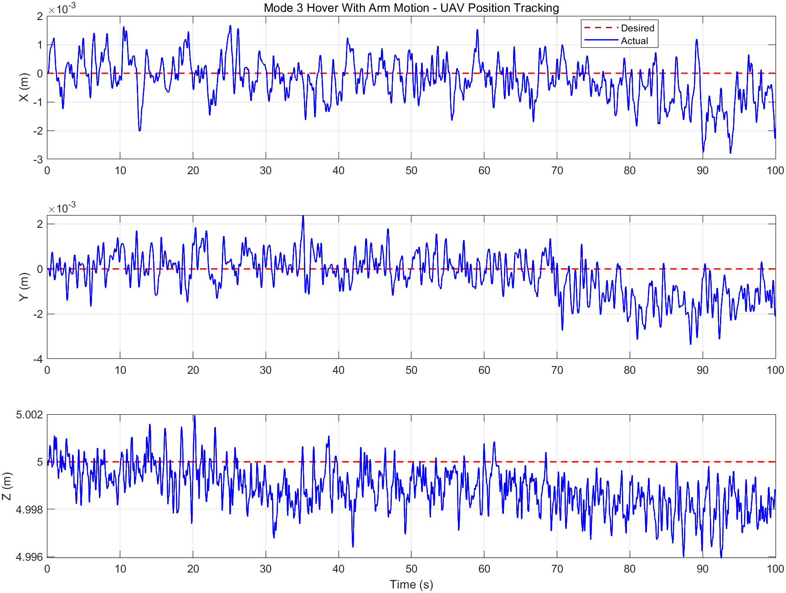
- 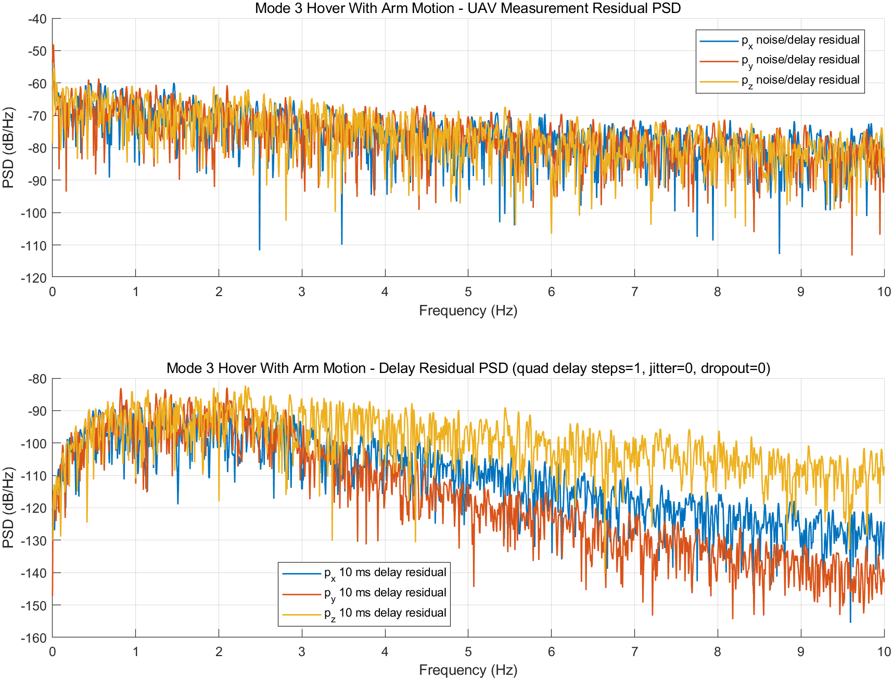
- 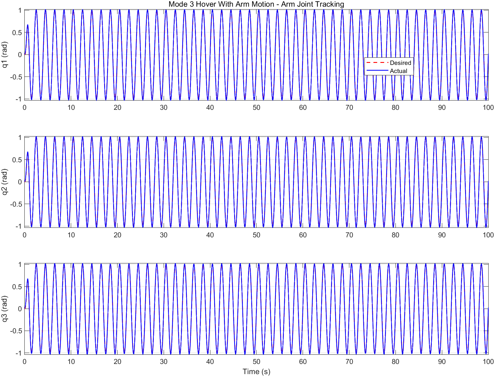
- 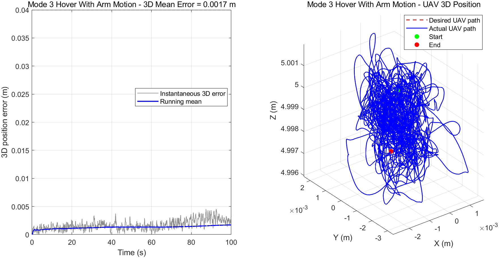
- 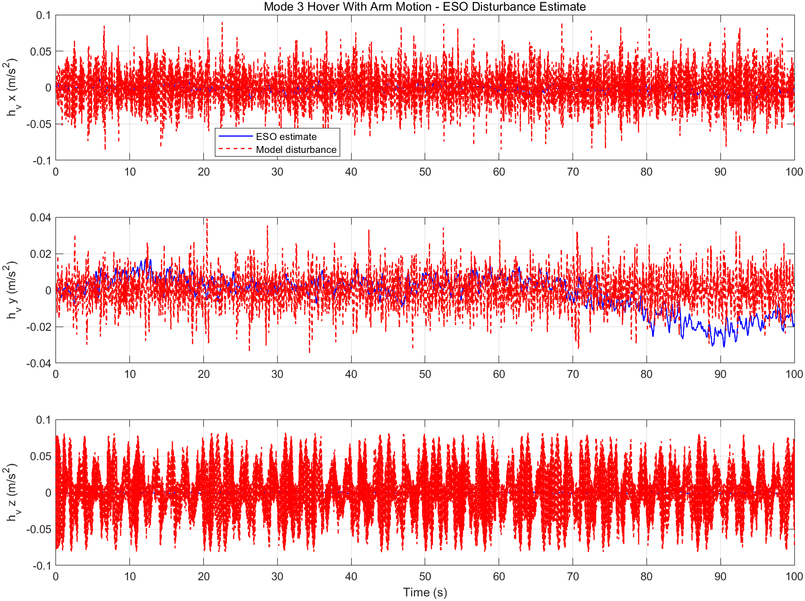
- 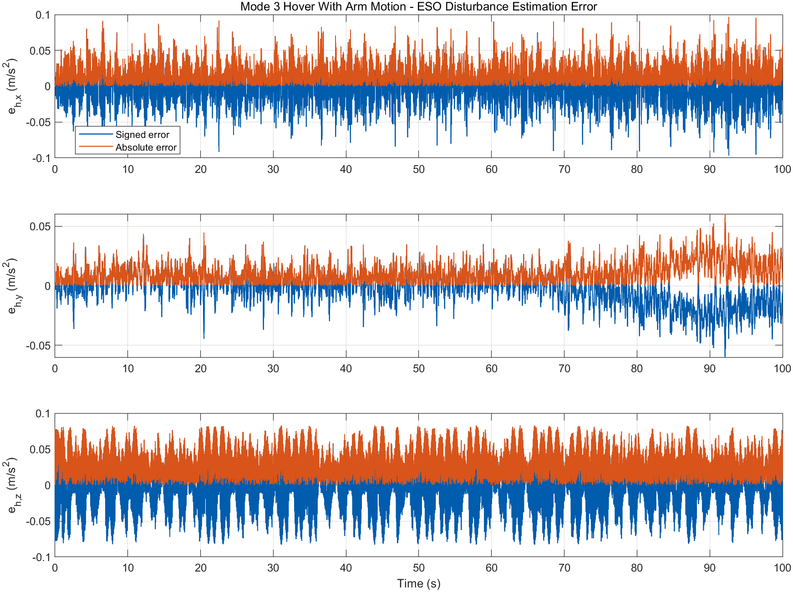

### Mode 5: Square Tracking With Arm Motion

Mode 5 is designed to verify whether the UAV can perform horizontal trajectory tracking while the manipulator is moving. Compared with mode 3, this scenario adds translational motion and corner transitions, so it tests both disturbance rejection and trajectory-following performance. The UAV tracks a square-like planar mission around the hover height while the arm follows the same sinusoidal joint-motion pattern.

The mode 5 reference starts at the plant's hover height (`z = 5 m`) so that the metric measures controller tracking performance rather than an artificial initial-condition mismatch. Earlier runs exposed this issue: the model started at `5 m` while the reference started at `0 m`, producing a non-controller `5 m` initial error. The current scenario keeps the trajectory at the hover height from `t = 0`.

The same empirical measurement perturbations are used as in mode 3: measurement noise, bias walk, quantization, colored-noise shaping, and the configured quadrotor delay. Delay jitter, dropout, wind, actuator faults, payload changes, and collision/contact disturbances are not enabled in this validation.

Final fresh validation result:

- Axis mean position error: `[0.001006, 0.001538, 0.000626] m`.
- Axis max position error: `[0.006264, 0.006796, 0.002616] m`.
- ESO position max error: `[0.005003, 0.005467, 0.003485] m`.
- Maximum arm tracking error norm: `0.068300 rad`.
- Divergence flag: `false`.

Figures:

- 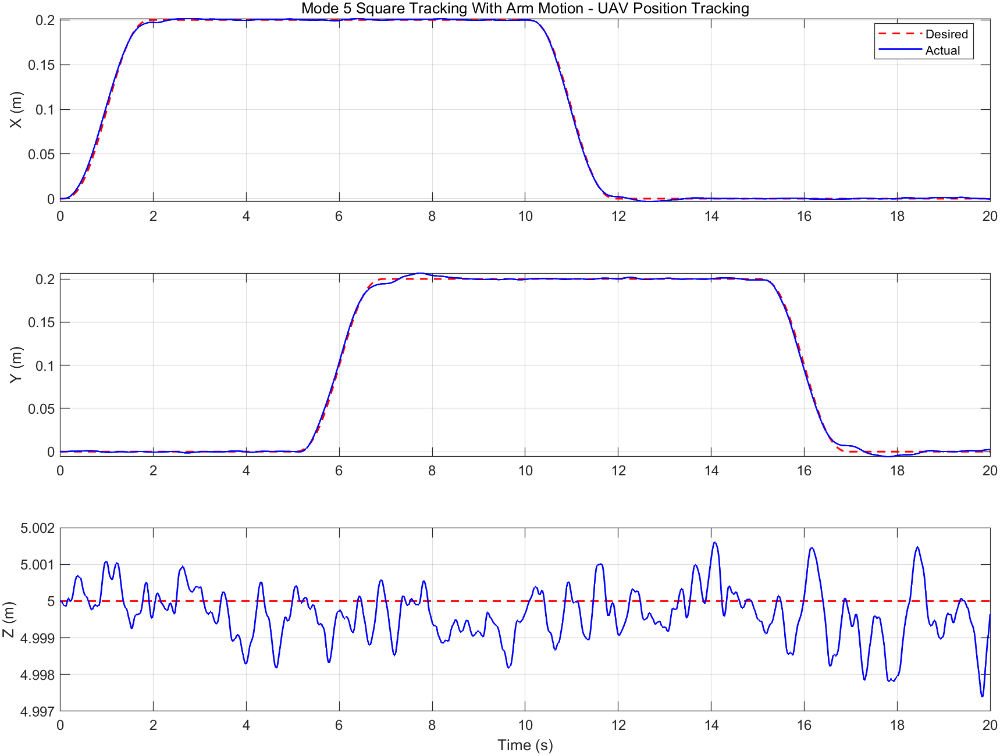
- 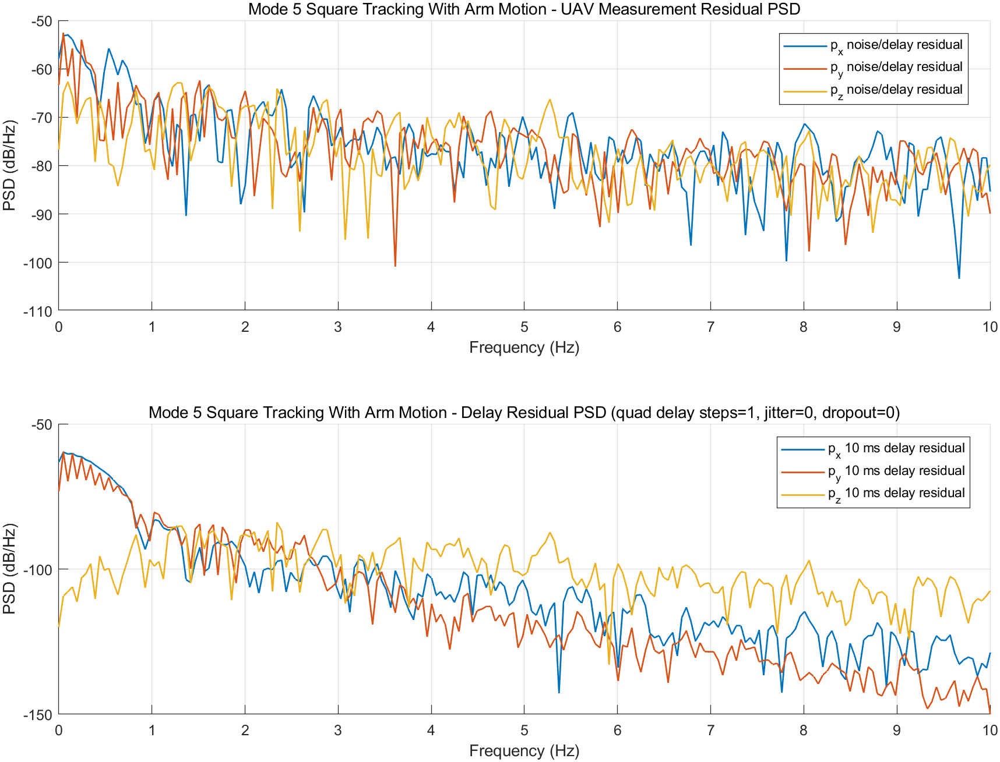
- 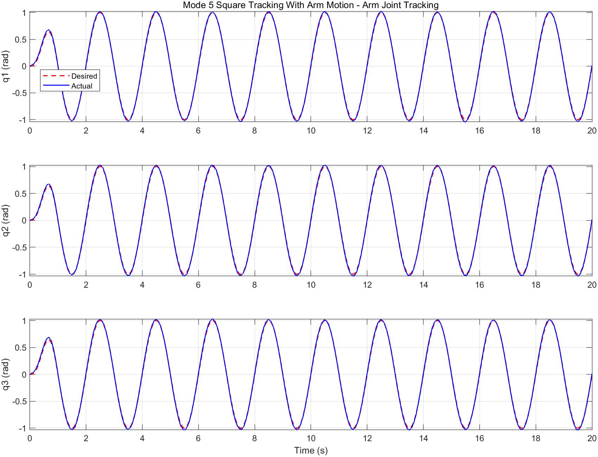
- 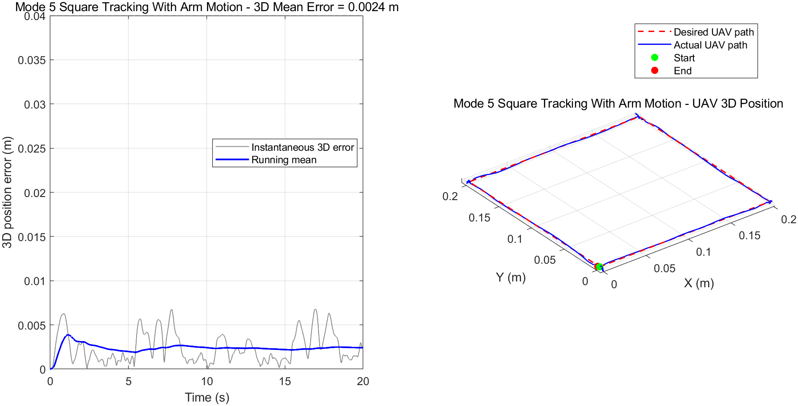
- 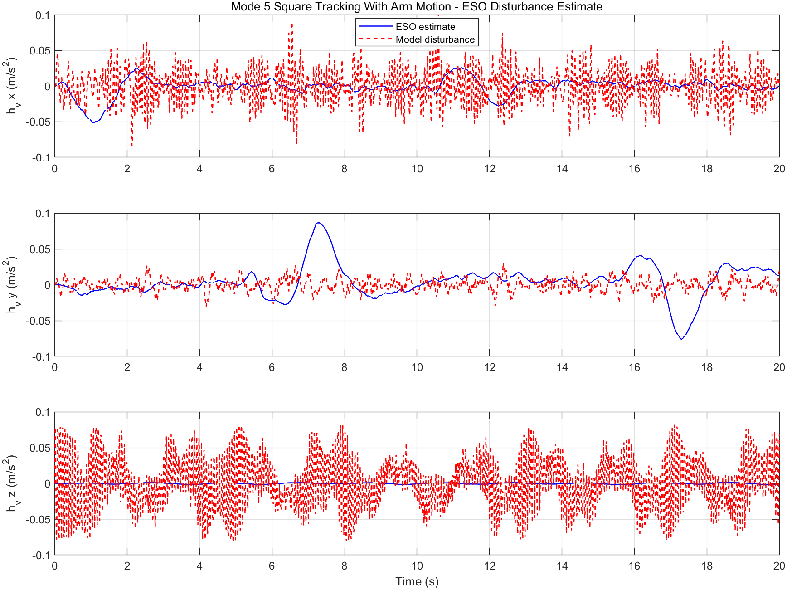
- 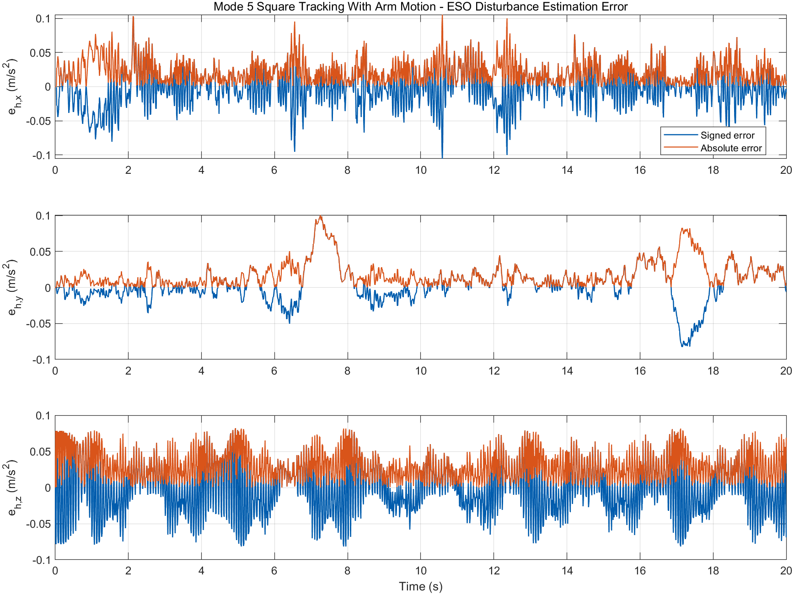

The PSD figures show the spectrum of measurement residuals and delay-induced residuals. They are diagnostic plots for the configured sensor model; the simulation does not currently log physically separated raw noise and pure delay channels.

## Reproducing The Figures

The report figures were generated from the final fresh validation files under `tuning_results/final_default_validation/`:

```matlab
plot_mode3_mode5_report
```

This writes PNG figures and `mode3_mode5_report_metrics.txt` into `figures/`.

## Notes

- MATLAB/Simulink is required.
- Large generated simulation artifacts should stay out of Git.
- Local Codex skill folders are ignored and should be kept on the local machine unless they are intentionally prepared for publication.
- The current autotuning workflow has already reduced mode 5 instability substantially, but the final `0.05 m` target still requires further tuning before parameter defaults should be persisted.
- The included paper PDF provides background for the ESO-based aerial manipulation controller design.
